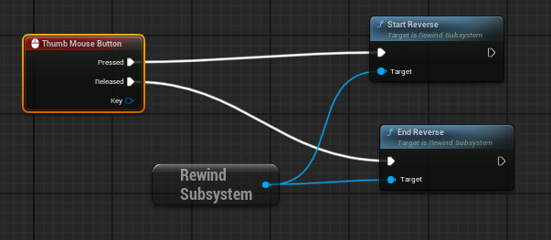

# Time Sync
 
# ⏪ Unreal Time Rewind Plugin

A powerful, flexible plugin for Unreal Engine that allows actors to rewind time with smooth interpolation. Ideal for gameplay mechanics like "undo", time-travel, or dynamic combat sequences.

## 🎮 Features

- ⏱ Rewind actor position, rotation, velocity, and custom properties
- 🧠 Efficient state storage using a linked list structure for fast insert/remove
- 🌀 Blueprint & C++ compatible
- 🔧 Works with both Tick and Timer-based recording strategies
- 💾 Minimal memory usage with dynamic memory control
- 🧩 Modular plugin structure

## 🛠 Technical Details

The rewind system is backed by a custom **linked list** data structure that dynamically stores snapshots of actor states (position, rotation, velocity, poses, etc.). This enables:

- Constant-time insertion and deletion of old frames
- Efficient traversal during rewind playback
- Fine-grained memory management for long recording windows

How to use: Add the rewind component to the actors and use: 
